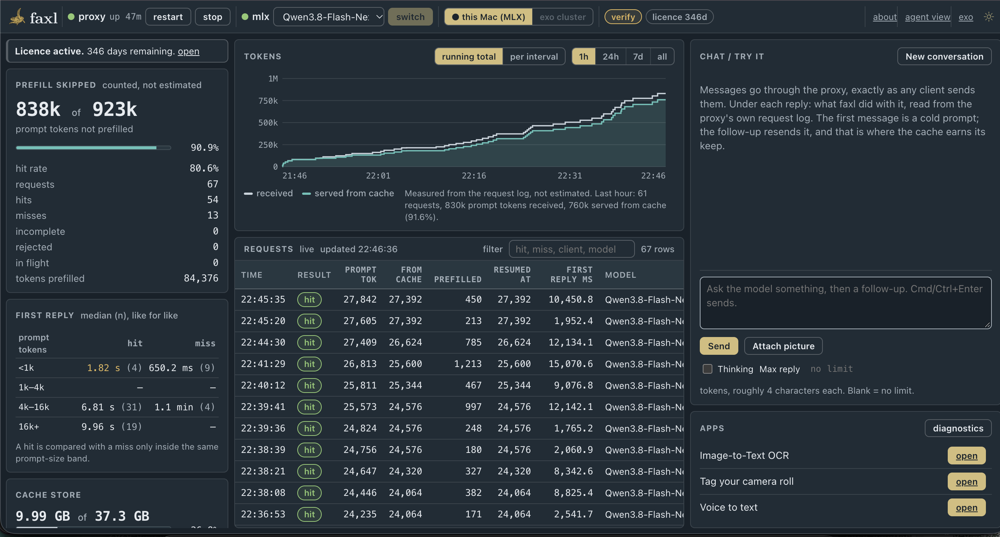

# faxl — disk-based prefill cache for local AI on Mac

faxl is an OpenAI-compatible proxy that sits between your clients and a model
running on your Mac. It saves the model's working state to SSD after every
turn. When the next request starts with text the model has already processed,
faxl loads that state and the model reads only the new part.



*One hour of agentic coding on a 128 GB Mac Studio, Qwen3.8-Flash-Next: 838k of
923k prompt tokens served from cache (90.9%). Prompts of 24–28k tokens resumed
with a few hundred tokens left to process.*

## Install

Needs Apple silicon and Python 3.12+.

```bash
python3 -m venv faxl-env && source faxl-env/bin/activate
pip install './faxl-0.1.0-cp39-abi3-macosx_11_0_arm64.whl[mac]' \
            ./ultradim-0.5.0-cp312-abi3-macosx_11_0_arm64.whl
faxl-proxy
```

`[mac]` installs mlx, mlx-lm and mlx-vlm. Without mlx-vlm, vision models refuse
to start.

1. Open `http://127.0.0.1:8767/console`.
2. Paste your licence key from [faxl.ai](https://faxl.ai) into the Licence panel,
   then restart. The key is read once at startup. Without a key the proxy still
   serves every request, but caches nothing.
3. Pick a model in the console. The first load downloads it from HuggingFace;
   models over 30 GB take several minutes.
4. Point your client at `http://127.0.0.1:8767/v1`. Any API key string works.

## How it differs from other prefill caches

| | typical prefill cache | faxl |
|---|---|---|
| where the cache lives | GPU memory, gigabytes | SSD, up to the size of your disk |
| how long entries last | minutes, until evicted | until you delete them or the cap is reached |
| after a restart | empty | warm |
| after switching model | lost | each model keeps its own entries |
| hybrid models (Mamba, SSM, linear attention) | unsupported, or silently wrong | supported |
| what is saved | the prompt | the prompt and the answer |

The consequences:

- **Scheduled agent jobs hit a warm cache.** A cron job that runs the same
  system prompt and tools daily resumes from yesterday's state.
- **Switch models freely.** Use a vision model, go back to coding, and both
  caches are still hot.
- **Long conversations stay fast.** Each answer is checkpointed as it is
  delivered, so the next turn processes only your new message.

## Supported models

Measured on a 128 GB Mac Studio. tok/s is generation speed,
first token to last.

| model | type | memory | tok/s |
|---|---|---|---|
| Qwen3.6-35B-A3B-4bit | MoE | 19 GiB | ~51–61 |
| Qwen3.8-Flash-Next-OptiQ-2bit | GDN hybrid | 46 GiB* | 16.5 median |
| granite-4.0-h-small-8bit | Mamba hybrid | 32 GB on disk | — |
| Kimi-Linear-48B-A3B-6bit | linear attention | 37 GB on disk | — |
| Ling-3.0-tiny | bailing hybrid | 15 GB on disk | — |
| Qwen3-VL (4B–32B) | vision | — | — |

\* Flash-Next ships with a 33.6 GiB lookup table wired into RAM, of which about
16 rows are read per token. faxl memory-maps it automatically: peak memory
76.2 → 46 GiB, load time 27s → 10s. This is what lets it run on a 64 GB Mac.

Any model mlx-lm or mlx-vlm loads should work. faxl also ships loaders for
several hybrid models mlx-lm does not support.

Model switching: a request naming a different installed model makes faxl switch
to it (~6 s from Flash-Next to Qwen3.6). A model that isn't installed returns
`400 model_not_found` with the list of available models. faxl never downloads
a model unasked.

## The cache store

- **Location:** `~/.faxl/cache-general` by default. Change it in the console's
  cache panel or with `FAXL_BLOBS`.
- **Size cap:** 60 GB by default (`FAXL_STORE_CAP_GB`). At the cap, the least
  used entries are evicted first, scored by time since last hit over number of
  hits.
- **Separate stores:** point different projects at different folders, each
  with its own cap, so one can't evict another's work.
- **Models share a store safely.** Entries are keyed by model and settings, so
  one model never loads another's state.
- **Privacy:** the store contains your prompts as token ids. Files are 0600 in
  a 0700 directory. Nothing leaves the machine.

## The console

`http://127.0.0.1:8767/console`, served by the proxy, works offline.

- prompt tokens served from cache, hit rate, hits and misses
- first-reply time for hits vs misses, compared within the same prompt size
- every request: tokens from cache, tokens processed, resume position, first
  reply, model, client
- generation speed per request and per model
- cache store size and location
- model picker and switcher, licence panel, chat window to try the model
- `/console/verify`: runs the same prompt with and without the cache and
  compares the output

Each page is also available as plain text or JSON for terminals and agents.

## Configuration

| variable | default | effect |
|---|---|---|
| `FAXL_PORT` | `8767` | listen port (loopback only) |
| `FAXL_MODEL` | from `~/.faxl/config.json` | model to serve |
| `FAXL_BLOBS` | `~/.faxl/cache-general` | cache store folder |
| `FAXL_STORE_CAP_GB` | `60` | store size cap |
| `FAXL_NOCACHE` | `0` | `1` = run without the cache, for A/B comparison |
| `FAXL_SETTLE` | `1` | `0` = don't checkpoint answers on delivery |
| `FAXL_MAX_TOKENS_DEFAULT` | unlimited | cap on reply length when the client sends none |
| `FAXL_ENABLE_THINKING` | model default | turn reasoning blocks on/off for models that have them |

Endpoints: `/v1/chat/completions` (streaming and tools), `/v1/models`,
`/health`, `/metrics`, `/console`.

Don't change `FAXL_SEEDS`, `FAXL_CKPT_EVERY` or `FAXL_CKPT_RATIO`: they define
the cache namespace, and changing them makes existing entries unusable.

## For agents: MCP server

`faxl-mcp` is installed with the wheel and registered by the included
`.mcp.json`.

| tool | does |
|---|---|
| `faxl_status` | pid and `/health`, including licence |
| `faxl_start` | start the proxy in the background |
| `faxl_stop` | stop it; the store persists |
| `faxl_install_licence` | write a licence key |
| `faxl_metrics` | hits, hit rate, tokens skipped and processed |

Full agent instructions: [AGENTS.md](AGENTS.md).

## Running it for a team

faxl binds to loopback and has no authentication. To share one Mac Studio
across a team, see the
[shared server section](faxl_tester_instructions.md#running-it-as-a-shared-server-eg-a-lab-mac-studio):
exposure, concurrency, storage caps and a launchd service.

## exo clusters

A model too large for one Mac can run across several, with exo doing the
inference and faxl in front of it doing the caching. The shape is the same as
on one machine: your client talks to faxl, faxl talks to exo.

**exo is not included.** Install and run it yourself — faxl does not start it,
and without a cluster the console's exo page simply reports that exo is not
answering. Nothing else breaks.

Point faxl at it:

```sh
ENG=$(python -c "import faxl.engine,os;print(os.path.dirname(faxl.engine.__file__))")
bash "$ENG/faxl_exo_up.sh"            # or: faxl_exo_up.sh org/model-name
```

That records `exo` as the backend in `~/.faxl/config.json`, so the choice
survives a restart, and hands over to the normal launcher. Switching back is
the backend control in the console, or running `faxl-proxy` again.

| | |
|---|---|
| exo endpoint | `http://127.0.0.1:52415` — `FAXL_EXO_ENDPOINT` |
| prefill port | `52440` — `FAXL_PREFILL_PORT` |
| cache store | `~/.faxl/exo-store` — `FAXL_EXO_STORE` |
| console page | `/console/exo` — nodes, downloads, catalogue, logs |
| stopping exo | `bash "$ENG/exo_stop.sh"` |

The exo store is **separate from the local one**, deliberately: the two
backends compute state differently, and a checkpoint from one must never be
served to the other.

With no model remembered for exo, faxl comes up on the small default rather
than something only a large cluster can hold. Pick the big model from exo's
catalogue in the console, where the fit check can size it against the
cluster's memory before you commit to a download.

**Lightly tested.** This path works and is shipped, but it has had far less
use than the single-Mac one. If you are running a cluster we would like to
hear from you — andrew@gamakon.ai.

## Troubleshooting

| symptom | cause | fix |
|---|---|---|
| every request `cold`, `/health` shows `licensed: false` | no key, or expired | install the key, restart |
| every request `cold`, licence fine | prompts share no prefix, or are under 64 tokens | expected |
| `!! VOLATILE STORE` at boot | store under `/tmp` | set `FAXL_BLOBS` to a real folder |
| `FATAL: the 'faxl' wheel is not installed` | wrong Python | install the wheels into the Python that runs the proxy |
| vision model refuses to start | mlx-vlm missing | reinstall with `[mac]` |
| boot sits at model load | large model paging in | wait; first load of a 30 GB+ model takes minutes |
| console's exo page says exo is not answering | exo not running, or on another port | start exo; check `FAXL_EXO_ENDPOINT` |
| exo model download never starts | registering fetches the card, not the weights | use the download control on `/console/exo` |

## In progress

- **Speculative decoding.** faxl is already building a table of what usually
  follows what from your sessions. Drafting from it is in testing and off in
  this build.
- **exo clusters.** Shipped and working, lightly tested — see
  [exo clusters](#exo-clusters) above. Testers wanted.
- **NVIDIA.** The cache engine is shared; the NVIDIA build is separate.

## Releases and licence

[CHANGELOG.md](CHANGELOG.md) lists what changed in each wheel. The filename
doesn't change between releases; `/health` shows which build you have.

Free for noncommercial use under [PolyForm Noncommercial 1.0.0](LICENSE.md).
Commercial licences: andrew@gamakon.ai. The UltraDim wheel is
[proprietary](LICENSE-UltraDim.md), licensed as a component of faxl only. See
[NOTICE.md](NOTICE.md).

Publishing a wheel to this repo: follow
[RELEASE-CHECKLIST.md](RELEASE-CHECKLIST.md).
